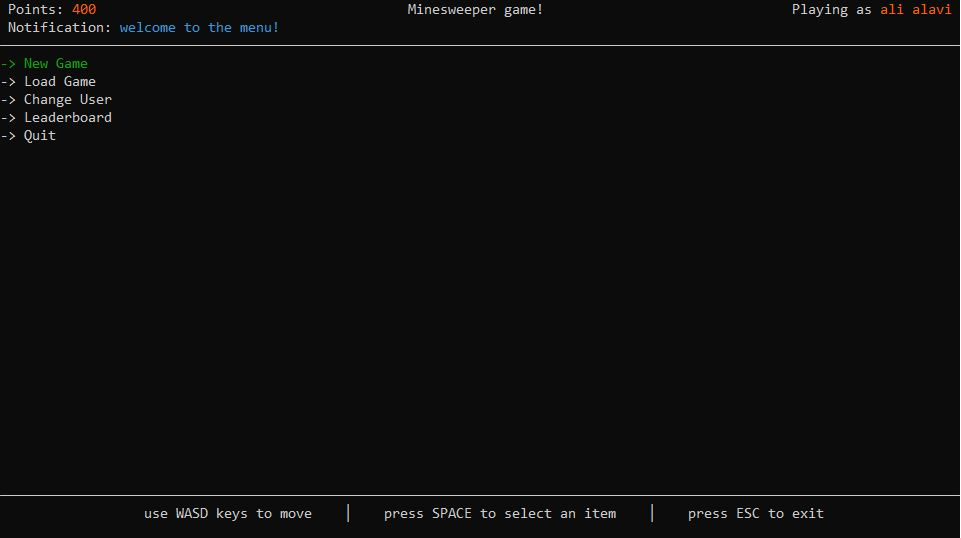
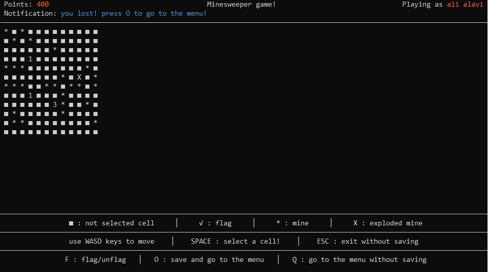
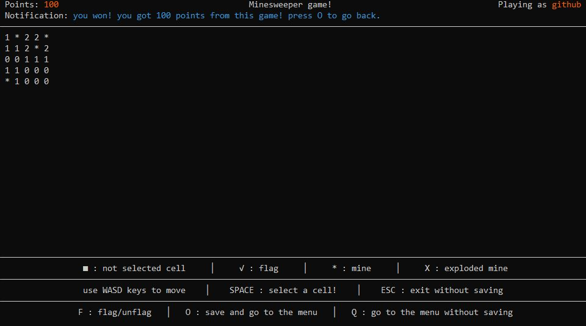
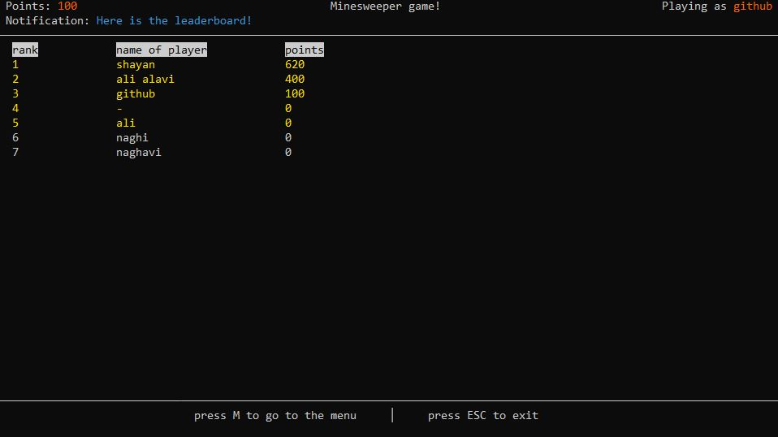

# Minesweeper CLI game
The 1st semester project

## Some screenshots

## Important informations
- program has worked fine with c++ 11
- file paths given to fstream works for windows. however it may not work in linux distributions/mac os.
### What if got an error?
  if you got file errors, just delete ".\\data\\" from every fstream file openings and 
   
  in working directory(where the program is) make 3 files with names of:
   
  1. players.txt
  2. players_points.txt
  3. saved_games_count.txt
    
  and finally it should work fine :)
